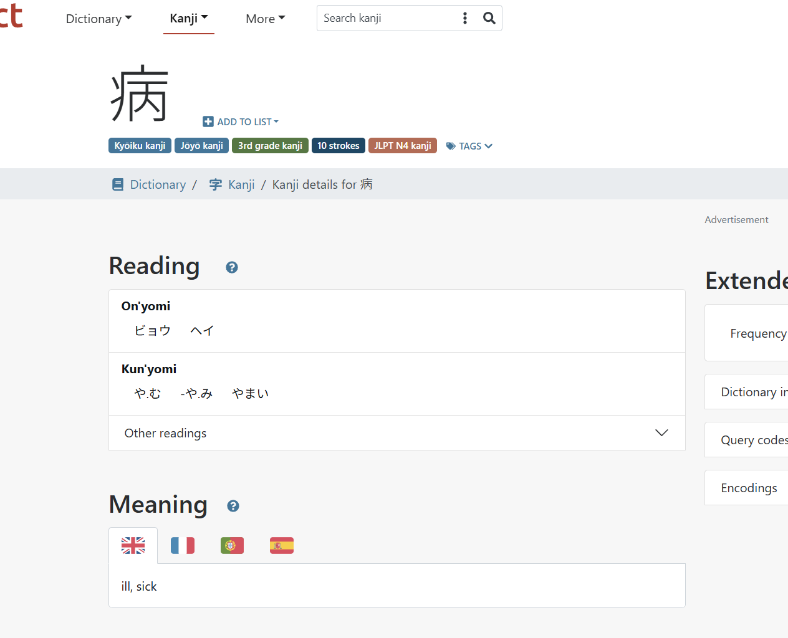

# Dokumentation Japanischlern-App für Android

## 1. Einleitung
### 1.1 Ziel der Arbeit und Problemstellung

Das Ziel dieser Arbeit war es eine Android App zu entwickeln, mit der man auf dem Smartphone die Japanische Sprache erlernen kann. 

Problemstellung: Da ich selbst Japanisch lerne habe ich bereits schon nach Apps Ausschau gehalten. Da gibt es jedoch leider nicht viele Möglichkeiten. Auf dem Computer habe ich jeweils Wanikani genutzt. Wanikani ist eine Website die auf dem Spaced-Repetition-System (SRS) basiert.

### 1.2 Spaced-Repetition-System

Das SRS System ist ein Algorithmus welcher neue Wiederholungen basieren auf der zuvorigen Leistungen berechnet. Wenn der User ein bestimmtes Wort immer richtig hat, so steigt es in der Ordnung. Dabei gibt es mehrere Levels. Bei Wanikani sind die Levels wie folgt: 

- Apprentice 1
- Apprentice 2
- Apprentice 3
- Apprentice 4
- Guru 1
- Guru 2
- Master
- Enlightened
- Burned 

Bei SRS wird dann basierend auf dem Level indem sich das Vokabular befindet der nächste Review-Intervall berechnet. Bei Wanikani ist dies wie folgt:

Apprentice 1 → 4 Stunden → Apprentice 2  
Apprentice 2 → 8 Stunden → Apprentice 3  
Apprentice 3 → 1 Tag → Apprentice 4  
Apprentice 4 → 2 Tage → Guru 1  
Guru 1 → 1 Woche → Guru 2  
Guru 2 → 2 Wochen → Master   
Master → 1 Monat → Enlightened  
Enlightened → 4 Monate → Burned

Wanikani ist ein bezahlter Abo-Service. Zudem bieten sie nur eine Webseite an. Dann habe ich Playstore nachgeschaut und gesehen, dass es eine inoffizielle App gibt. Diese habe ich ausprobiert, jedoch hat mir das App Aussehen nicht gefallen und es war alles zu klein.

Da ich bereits 3 Jahre Erfahrung mit Android Development im Bereich Androiddevlopment habe (2 Jahre mit XML und Kotlin
1 Jahr mit Jetpack Compose und Kotlin) 
habe ich mir gedacht, dass ich mir die App einfach selbst baue. So kann ich auch die Features die ich haben will, selbst einbauen.

## 2. Hintergrund über das Japanische Schriftsystem
Die Japanische Sprache besitzt 3 verschiedene Schriftsysteme:
- Hiragana
- Katakana
- Kanji

Je nach Situation werden die jeweiligen Schriften verwendet. Sie kommen oft auch gemischt vor. Genaueres dazu im Folgenden:

### 2.1 Hiragana und Katakana
Hiragana und Katakana sind Silbenschriften. Dies bedeutet dass jedesn Zeichen eine Silbe repräsentiert. Die Hiragana Schrift wird benutzt für:
- Konjugation bei Verben
- Deklination von Adjektiven
- Partikeln
- Hilfswörter
- Furigana
- Kindertexte
- Lautmalerei (für sanftere Geräusche)


 (3) Diese Tabelle repräsentiert alle Hiragana Zeichen.


Die Katakana Schrift wird benutzt für:
- Lehnwörter aus anderen Sprachen
- Lautmalerei 
- Betonung (wie Kursivschrift im Deutschen)
- Lehnwörter aus anderen Sprachen
- Abkürzungen


### 2.2 Kanji
Die Kanjis haben im Japanischen 3 verschiedene Lesungen: On-Lesung, Kun-Lesung, Nanori-Lesung.
Die Nanori-Lesung wird für Namen verwendet. Die On-Lesung wird meist verwendet wenn mehrere Kanjis ein Wort bilden. wie im Beispiel 病院、da wird 病、also byou gelesen, da ist die On-Lesung byou. Wenn man das Kanji einzeln verwenden will, oder in Zusammenhang mit Hiragana, z.B. beim Konjugieren von Verben oder beim Deklinieren von Adjektiven, wird meist die Kun-Lesung verwendet. z.B. mit demselben Kanji: 病む (yamu) krank werden, hier wird das Kanji mit ya gelesen, was der Kun-Lesung entspricht.

Aus diesem Grunde werde ich beim Kanjimodus, die On-Lesung programmieren und wenn das Kanji selbst ein eigenes Wort bilden kann, die Kun Lesung verwenden.

 (1)

Das ist z.B. ein Eintrag aus einem Wörterbuch dieses Kanjis, manche Kanjis haben auch nicht alle 3 Lesungen, wie dieses. Hier gibt es keine Nanori-Lesung, da man nicht gerne ein Zeichen, welches krank sein bedeutet in einem Namen haben will.

 (2)

Bei manchen, wie diesem gibt es auch ganz viele verschiedene Lesungen. Ich verwende bei dem Kanjimodus, die, die für die meisten Wörter zutrifft.

### 2.3 Beispielsatz

 ```昨日、スーパーでバナナを三本買いました。```

Dieser Satz bedeutet: Gestern habe ich im Supermarkt 3 Bananen gekauft.

昨日 = gestern, Zeiteinheiten werden in Kanji geschrieben.
ス－パ－ Supermarkt(wörtl. Suupaa), ist ein Fremdwort und eine Abkürzung wird daher in Katakana geschrieben.  
で Partikel, die anzeigt wo eine Aktion stattfindet, Partikeln werden in Hiragana geschrieben.  
バナナ Banane (wörtl. Banana) ist ein Fremdwort, wird daher in Katakana geschrieben.  
を Ist eine Partikel die anzeigt, welches das Objekt ist. Partikeln werden in Hiragana geschrieben.  
三本 3 zylindrische Objekte. 三 bedeutet drei, ist ein natives Japanisches Wort daher in Kanji. 本 ist eine Zähleinheit für zylindrische Objekte. Ist ein natives japanisches Wort.   
買いました gekauft haben 買う ist der Infitiv. Die Endung des Verbes wird angepasst, hier an die Vergangenheit.
。Das ist ein Punkt (Satzzeichen).

Wie man sehen kann werden die 3 Schriftarten miteinander vermischt.


## 3. Vorgehen und Umsetzung

Die App sollte Lernenden helfen, japanische Kanji und japanische Vokabeln mit englischer Übersetzung zu lernen. Dabei wurden mehrere Anforderungen definiert, die schrittweise umgsetzt wurden:

### 3.1 Kanji Liste mit englischen Übersetzungen erfasst.

Da ich das Projekt schon länger im Kopf hatte, hatte ich bereits zuvor schon die API von Wanikani abgefragt, nach den Kanjis. Diese hatte ich mir dann mit einem C# Script in Json Files notiert. Ich habe dann diese Json Dateien in den Android Assets Ordner meiner App geladen. Anschliessend habe ich mir mit Room (eine Sqllite basiert Datenbank die mit Annotation Processing funktioniert), eine relationale Datenbank geschrieben. Ich habe auch einen Json Parser geschrieben. Anschliessend habe ich die Daten in die Datenbank geschrieben.

Die Datenbank beinhaltet 2074 Kanji mit ihren dazugehörigen On-Lesungen und ihren Bedeutungen. Die Kanji sind in 60 Lektionen unterteilt (wie bei Wanikani).

```json 
{
    "KanjiJson": {
      "lessonNumber": 1,
      "id": 440,
      "kanji": "一",
      "meanings": [
        {
          "meaning": "One",
          "primary": true,
          "accepted_answer": true
        }
      ],
      "readings": [
        {
          "type": "onyomi",
          "primary": true,
          "reading": "いち",
          "accepted_answer": true
        },
        {
          "type": "onyomi",
          "primary": true,
          "reading": "いつ",
          "accepted_answer": true
        },
        {
          "type": "kunyomi",
          "primary": false,
          "reading": "ひと",
          "accepted_answer": false
        },
        {
          "type": "nanori",
          "primary": false,
          "reading": "かず",
          "accepted_answer": false
        }
      ]
    },
    "Meaning": null,
    "Reading": null
  }
  ```

  Dies ist das erste Json Objekt in der meiner Datei bezüglich Lektion 1. 

| id | lessonNumber | kanjiId | kanji |
| :--- | :--- | :--- | :--- |
| 1 | 1 | 440 | 一 |
| 2 | 1 | 441 | 二 |
| 3 | 1 | 442 | 九 |
| 4 | 1 | 443 | 七 |
| 5 | 1 | 444 | 人 |
| 6 | 1 | 445 | 入 |
| 7 | 1 | 446 | 八 |
| 8 | 1 | 447 | 力 |
| 9 | 1 | 448 | 十 |
| 10 | 1 | 449 | 三 |
| 11 | 1 | 450 | 上 |
| 12 | 1 | 451 | 下 |
| 13 | 1 | 452 | 口 |
| 14 | 1 | 453 | 大 |
| 15 | 1 | 454 | 女 |
| 16 | 1 | 455 | 山 |
| 17 | 1 | 456 | 川 |
| 18 | 1 | 457 | 工 |

Sqllite Tabelle: Kanji


| meaningId | kanjiOwnerId | meaning | primary | acceptedAnswer |
| :--- | :--- | :--- | :--- | :--- |
| 1 | 440 | One | 1 | 1 |
| 2 | 441 | Two | 1 | 1 |
| 3 | 442 | Nine | 1 | 1 |
| 4 | 443 | Seven | 1 | 1 |
| 5 | 444 | Person | 1 | 1 |
| 6 | 445 | Enter | 1 | 1 |
| 7 | 446 | Eight | 1 | 1 |
| 8 | 447 | Power | 1 | 1 |
| 9 | 447 | Strength | 0 | 1 |
| 10 | 447 | Ability | 0 | 1 |
| 11 | 448 | Ten | 1 | 1 |
| 12 | 449 | Three | 1 | 1 |

Sqllite Tabelle: Kanji Meaning


| readingId | kanjiOwnerId | type | primary | reading | acceptedAnswer |
| :--- | :--- | :--- | :--- | :--- | :--- |
| 1 | 440 | onyomi | 1 | いち | 1 |
| 2 | 440 | onyomi | 1 | いつ | 1 |
| 3 | 440 | kunyomi | 0 | ひと | 0 |
| 4 | 440 | nanori | 0 | かず | 0 |
| 5 | 441 | onyomi | 1 | に | 1 |
| 6 | 441 | kunyomi | 0 | ふた | 0 |
| 7 | 442 | onyomi | 1 | く | 1 |
| 8 | 442 | onyomi | 1 | きゅう | 1 |
| 9 | 442 | kunyomi | 0 | ここの | 0 |
| 10 | 443 | onyomi | 1 | しち | 1 |
| 11 | 443 | kunyomi | 0 | なな | 0 |
| 12 | 443 | kunyomi | 0 | なの | 0 |


Sqllite Tabelle: Kanji Reading


Dies sind nur Auszüge aus der Datenbank. Die ganze Datenbank ist auf Box im "Ordner Database" der Pdf Datei: "Ganze Datenbank" zu finden. Ebenso ist in dem Ordner eine Datenbankdatei im Format sqqlite vorhanden. "kanjidatabase_db.db".

### 3.2 Simple GUI

Ich habe ein simples GUI erstellt. Da ich Jetpack Compose verwende, kann man gleich darin die Oberflächen mit Kotlin Code gestalten.
```kotlin
@Composable
fun HomeScreen(navController: NavController) {
    Surface(
        modifier = Modifier.fillMaxSize(),
        color = MaterialTheme.colorScheme.background
    ) {
        Box(
            modifier = Modifier
                .fillMaxSize()
                .padding(16.dp),
            contentAlignment = Alignment.Center

        ) {
            Column {
                StartLearnSessionButton(navController)
                Spacer(modifier = Modifier.height(40.dp))
                SettingsButton()
            }
        }
    }
}
```

Dies ist der Code für den HomeScreen, welcher für das UI zuständig ist. Im Code werden Funktionen aufgerufen zu einem StartLearnSessionButton und einem SettingsButton. Beide Buttons existieren, jedoch hat der Settingsbutton keine Funktion daher zeige ich hier aus Illustrationszwecken den StartLearnSessionButton.


```kotlin
@Composable
fun StartLearnSessionButton(navController: NavController) {
    Button(
        onClick = { startLearnSession(navController) },
        colors = ButtonDefaults.buttonColors(containerColor = primaryButtonColor),
        modifier = Modifier
            .size(width = 300.dp, height = 60.dp)
    ) {
        Text("Start Learn Session")
    }
}

private fun startLearnSession(navController: NavController) {
    navController.navigate("LearnSession")
}
```

### 3.3 Kanji Lernmodus

Ich habe einen Kanji Lernmodus programmiert. Dieser Lernmodus zeigt dem User jeweils ein Kanji und der User wird zufällig nach der Lesung des Kanjis(in der Regel die On-Lesung) oder dessen Bedeutung gefragt. Die Lesungen hier gelten wenn mehrere Wörter aus Kanjis zusammengesetzt werden wie z.B. bei Shinkansen: 新幹線 (japanischer Hochgeschwindigkeitszug). Die Kanjis erscheinen in zufälliger Reihenfolge. Wird die Bedeutung gefragt, so erscheint der Hintergrund Pink und beim Antworteingabefeld steht: "Answer". Wird die Lesung verlangt so erscheint der Hintergrund in einem bräunlich-violetten Ton und im Eingabefeld steht: 答え (Japanisch für Antwort). Wird die Lesung verlangt, so werden gültige japanische Silben direkt in Hiragana verwandelt (mehr dazu unter 3.5 Japnische IME). Wenn man auf der Tastatur die Entertaste drückt oder auf den Submit Answer Button klickt, kommt man in den Korrekturmodus(mehr dazu unter 3.4 Korrektursystem). Nur wenn alle Fragen korrekt beantwortet wurden ist der Lernmodus vorbei und man kommt zum LernSessionOverview Screen. Auf diesem steht einfach nur "Welcome to the LearnSessionOverview Screen". Diesen konnte ich aus Zeitgründen nicht implementieren. (mehr dazu unter 3.6 nicht implementierte Features).

### 3.4 Korrektursystem
Ich habe ein Korrektursystem hinzugefügt.

Dieses Korrektursystem überprüft ob die beantwortete Frage mit der Lösung überprüft und korrekt ist. Dazu werden folgende Kriterien beachtet:
1. Sowohl die Antwort des Users als auch die Antwort des Users wird in Kleinbuchstaben umgewandelt.
2. Es wird geschaut ob die Antwort des Users exakt mit einer Antwort aus der Lösung übereinstimmt (manchmal gibt es mehrere Antworten in einer Liste) und ob die entsprechende Antwort als Lösung akzeptiert wird.
3. Sollte die Lösung übereinstimmen, so wird die Frage zur einer Liste namens **askedQuestions** hinzugefügt.
4. Relevante Booleans/Variablen werden geändert, damit das UI aktualisiert werden kann. 
5. Sollte die Lösung übereinstimmen wird in der Mitte des Screens __*Correct*__ in grüner Schrift angezeigt.
6. Sollte die Lösung nicht übereinstimmen, so werden alle Lösungen von einer Liste zu einem String kombiniert und dem User angezeigt. Ebenso wird in der Mitte des Bildschirms ein __*Wrong*__ in roter Farbe angezeigt.
7. Durch das Ändern entsprechender Variabeln in Punkt 4 wird nun im __*Korrekturmodus*__ ein Button namens __*NextQuestion*__ angezeigt.
8. Wenn der User nun auf diesen Button drückt, so wird der Korrekturmodus deaktiviert undd die nächste Frage angezeigt.

### 3.5 Japanische IME
Ich habe eine Japanische IME Library programmiert. Diese Library verfügt über 3 Klassen: Eine HiraganaParser Klasse, eine Katakanaparser Klasse, und eine KanaParser Klasse. 
In der HiraganaParser und der Katakanaparser Klasse sind Hiragana und Katakana mit der entsprechenden Definition in Romaji(Lateinischen Buchstaben) notiert. 

```kotlin
    private val vowels = mapOf(
            "a" to "あ",
            "i" to "い",
            "u" to "う",
            "e" to "え",
            "o" to "お"
        )

        private val kRow = mapOf(
            "ka" to "か",
            "ki" to "き",
            "ku" to "く",
            "ke" to "け",
            "ko" to "こ"
        )
 ```
Auszug aus der HiraganaParser Klasse


In der KanaParser Klasse sind Methoden notiert Romaji in Kana und Kana in Romaji umzuwandeln. Will man Romaji in Kana umwandeln, so muss man noch spezifizieren, ob dies in Hiragana oder Katakana geschehen soll.

```kotlin
       /**
         * Converts a romaji or mixed romaji & kana string into the specified Kana type.
         *
         * @param mixedString The input string, which may contain romaji or a mix of romaji and kana.
         * @param kanaType The type of kana the text should be converted to
         * @return The Converted kana string.
         */
        fun parseRomajiToKana(mixedString: String, kanaType: KanaType): String {
            currentKanaMap = if (kanaType == KanaType.HIRAGANA) HiraganaParser.getAllHiraganas()
            else KatakanaParser.getAllKatakana()

            val sb = StringBuilder()
            var i = 0
            val input = mixedString

            while (i < input.length) {
                var matched = false
                // Try 3, 2, 1 length matches
                for (len in 3 downTo 1) {
                    if (i + len <= input.length) {
                        val sub = input.substring(i, i + len)

                        // Check if sub is already kana (keep as is)
                        if (currentKanaMap.containsValue(sub)) {
                            sb.append(sub)
                            i += len
                            matched = true
                            break
                        }

                        // Check if sub is a romaji syllable
                        val kana = currentKanaMap[sub]
                        if (kana != null) {
                            sb.append(kana)
                            i += len
                            matched = true
                            break
                        }
                    }
                }

                // If no match found, just append current char and move on (avoid infinite loop)
                if (!matched) {
                    sb.append(input[i])
                    i++
                }
            }
            return sb.toString()
        }
```
Auszug aus der KanaParser Klasse.

Wenn nun die Lesung des Kanjis gefordert ist, so wird beim eingeben romaji direkt in Hiragana umgewandelt.

```kotlin
   fun onAnswerInputChanged(newText: String) {
        if(currentAnswerMode == AnswerModeType.READING) {
            val parsedKana =KanaParser.parseRomajiToKana(newText, KanaParser.Companion.KanaType.HIRAGANA)
            userAnswer = parsedKana
        }
        else {
            userAnswer = newText
            Log.d("KanjiViewModel", "userAnswer: ${userAnswer}")
        }
    }
 ```

 Auszug aus der Funktion welche jedesmal ausgeführt wird, wenn man was eingibt.
### 3.6 Nicht implementierte Features
Folgende Features konnte ich aus Zeitgründen nicht implementieren:

- SRS Implementation
- Audiodateien
- Vokabelliste mit englischen Übersetzungen erfasst.

### 3.7 Sonstiges
Ich habe am Anfang des Projektes Firebase Crashanalytics hinzugefügt um Crashreports auch dann sehen zu können wenn mein Smartphone nicht mit Android Studio verbunden ist, z.B. unterwegs. Dies funktioniert auch, benutzt habe ich es schlussendlich jedoch nicht.


## 4. Probleme
Allgemeine Problemlösungstaktik:  
Beim Programmieren schaue ich jeweils den Code selbst an, sollte ich jedoch keine Lösung finden,so google ich die Fehlermeldung oder ChatGPT oder Microsoft Copilot. Dies tue ich jeweils auf Englisch. Sollte ich da nicht weiterkommen, so schaue ich nach intensiver bei Google nach oder schaue YT Tutorials. Finde ich trotzdem keine Lösung, so versuche ich eine andere Lösung zu finden.

### 4.1 Probleme mit der Datenbank
Ich hatte beim Implementieren der Datenbank mit Room Probleme, als ich sie zum Laufen kriegen wollte. Denn ich habe einen __*android.database.sqlite.SQLiteConstraintException: UNIQUE constraint failed*__
Fehler erhalten. Ich war zuerst verwirrt, jedoch war ich mir sicher dass jedes Kanji nicht mehrmals vorkommt. Also habe ich zuerst Chatgpt nach einem Powershell Script gefragt, welches mir überprüft, ob gewisse Ids mehrfach vorkommen und tatsächlich, eine Datei die Datei Kanji_Lesson60.json war indentisch mit der Datei Kanji_Lesson59.json. Dann bin ich dies durchgegangen und habe noch eine Datei namens Kanji_Lesson1_2.json entdeckt. Diese Datei war mit keiner der Dateien indentisch. Dann dachte ich, das wahrscheinlich die Lektionsnummer jeweils eins zu tief ist. Also habe ich aus mehreren Dateien zufällig Kanjis rauskopiert und dies mit dem Level auf Wanikani überprüft. Meine Theorie war korrekt. Nun habe ich also die Datei Kanji_Lesson60.json gelöscht. Dann habe ich Chatgpt nach einem Powershell Script gefragt, welches bei allen die Zahlen erhöht. Ich habe das Script ausprobiert, jedoch habe ich den Fehler bekommen, dass die Dateien bereits existieren, das Script hatte also keine temporäre Umbenennung. Also wieder Chatgpt gefragt, das neue Script hat wieder nicht funktioniert. Dann kam zufällig mein Vater vorbei und ich habe ihn um Hilfe gefragt. Er meinte ich sollte mal Microsoft Copilot ausprobieren. Also habe ich Copilot denselben Prompt gegeben. Zuerst kam wieder derselbe Fehler. Also habe ich den auch wieder reinkopiert und dieses Mal hat es funktioniert. Anschliessend habe ich die alten Dateien durch die neuen Dateien in meinem Projekt ersetzt und nun war das Datenbankproblem gelöst.

--> Chatgpt kann gut sein beim Coden, MicrosoftCopilot scheint jedoch besser zu sein. Mit Copilot habe ich bei diesem Projekt dann öfters korrekte Lösungen bekommen als bei Chatgpt.

### 4.2 Kanji Lernmodus UI nicht aktualisert
Als ich am Erstellen des Lernmoduses war und ihn getestet habe, bekam ich zuerst ein Uninitialized Error, da das Kanji zum Zeitpunkt der UI Erstellung noch nicht ausgewählt wurde. Ich habe die Funktion zwar direkt beim Start aufgerufen, jedoch war dies trotzdem zu langsam. Dann habe ich als leeren String initialisiert. Nun kam der Fehler nicht mehr, jedoch wurde das Kanji auch nicht angezeigt. Obwohl im Log, das Kanji geloggt wurde. Die UI wurde also nicht aktualisiert, nachdem das Kanji gewählt wurde. Die Lösung war es anstatt:

```kotlin
var currentKanji: String = ""
        private set
 ```
 zu verwenden, folgendes zu verwenden:

 ```kotlin
 var currentKanji by mutableStateOf("")
        private set
```
Dieser mutableStateOf sorgt dafür, dass die UI automatisch aktualisiert wird, wenn sich der Wert geändert hat.

### 4.3 Dependency Injection mit Hilt
Da ich die MVVM Architektur verwende, habe ich für Funktionen oft das viewModel gebraucht. da jedoch verschiedene Screens als Funktion und nicht als Klasse definiert werden und ich für jeden Screen eine eigene Datei zur klareren Trennung haben wollte, musste ich das ViewModel immer als Parameter in Funktionen schreiben. Um dies zu verhinden, ist es laut Microsoft Copilot möglich, Hilt als Dependency Injection Library zu verwenden. Dann muss ich nur jeweils eine bestimmte Funktion aufrufen und das Viewmodel ist da, ich müsste es nicht mehr durch Parameter an Funktionen weitergeben.
Ich habe versucht Hilt zu implementieren. Jedoch habe ich beim Buildprozess mit Gradle die Fehlermeldung erhalten, dass mein Buildsystem korrupt ist. dann habe ich gelesen dass ich die 1.8 der Java VirtualMachine verwenden soll und nicht die 1.11. Jedoch habe ich beim Verwenden von 1.8 die Fehlermeldung erhalten, dass diese veraltet ist, ich konnte das Projekt auch da nicht bauen. Am Ende habe ich es einfach so gelassen und Hilt wieder entfernt.

## 5. Resultate
 


Das sieht man wenn man die App startet. Beim oberen Button kommt man zum Lernmodus. Der SettingsButton ist funktionslos. Die Statusleiste oben wurde auch im entsprechenden Them zur App (Blau) eingefärbt.^^


Hier wird nach der Lesung des gezeigten Kanjis gefragt. Die Hintergrundfarbe weist auf den Lesungsmodus hin, ebenso das Eingabefeld auf dem 答え(kotae) steht, Japanisch für Antwort.
Die Antwort überprüft man indem man auf den __*Submit Answer*__ Button drückt oder auf Enter auf der Tastatur.


Ich habe hier nikanika eingeben, die Zeichen wurden während des Tippens in Hiragana umgewandelt.


Da der User die Antwort falsch eingeben hat, sieht man hier nun, __*Wrong*__ in roter Schrift, darunter die korrekte Antwort(はち).
Darunter sieht man noch den NextQuestion Button. Drückt man darauf, so gelangt man zur nächsten Frage.


Hier wird der User nun nach der Bedeutung des Kanjis auf Englisch gefragt. Zu erkennen am pinken Hintergrund. Zudem steht beim Eingabefeld nun __*Answer*__. 
Die Antwort überprüft man indem man auf den __*Submit Answer*__ Button drückt oder auf Enter auf der Tastatur.


Gibt man die Antwort im Meaning Mode ein, so wird sie nicht in Hiragana umgewandelt.


Wurde nach der Bedeutung gefragt, so wird auch dort dem User die korrekte Antwort angezeigt. Passt die Antwort nicht auf eine Zeile, so wird sie auf mehrere Zeilen aufgeteilt.


Wurden alle Kanjis einer Lektion abgefragt, so wird dem User der Learning SessionOverview Screen gezeigt. Hier steht aktuell nur "Welcome to the LearnSessionOverview Screen". Dies ist ein Platzhalter. Dieser Screen hat keine Funktion. Dies hat aus Zeitgründen nicht gereicht.
## 6. Fazit
Das Projekt hat mir sehr Spass gemacht und war auch sehr lehrreich. Es war manchmal frustrierend wenn es Fehler gab und ich diese nicht direkt auf Anhieb lösen konnte. Aufgrund solcher Fehler, habe ich mehr Zeit für Funktionen aufgewendet, als ich dies geplant hatte. Aus Zeitgründen konnte ich leider auch nicht alle Funktionen implementieren. Auch ist es so eingestellt, dass beim Lernen immer nur die Lektion 1 angezeigt wird. Es gibt kein richtiges Fortschrittssystem. Es gibt keine Möglichkeit innerhalb der App die Lektion zu ändern. 

Ich denke jedoch, dass die App visuell gut gestaltet ist und einen Mehrwert bringt. Jedoch ist noch etwas mehr Entwicklungszeit nötig um sie im alltäglichen Gebrauch gebrauchen zu können.

## 7. Code
Der Code befindet sich auf Github unter folgendem Link:
https://github.com/baumanager1/JapanischLernAppAKSA

## 8. Quellen
(1) https://www.japandict.com/kanji/%E7%97%85  
(2) https://www.japandict.com/kanji/%E4%B8%8A?lang=  
(3) https://jakobsjapanisch.de/artikel/hiragana-tabelle/